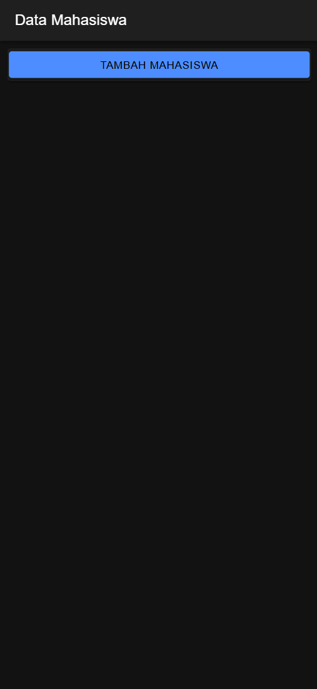
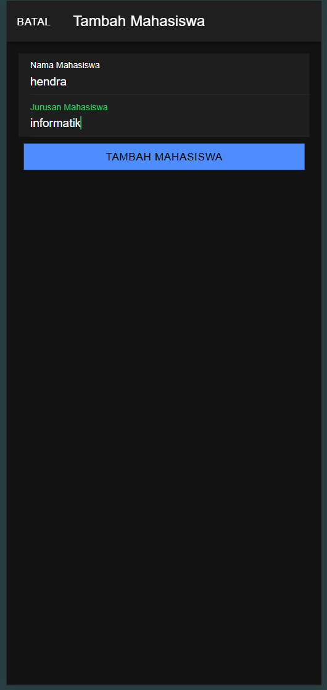
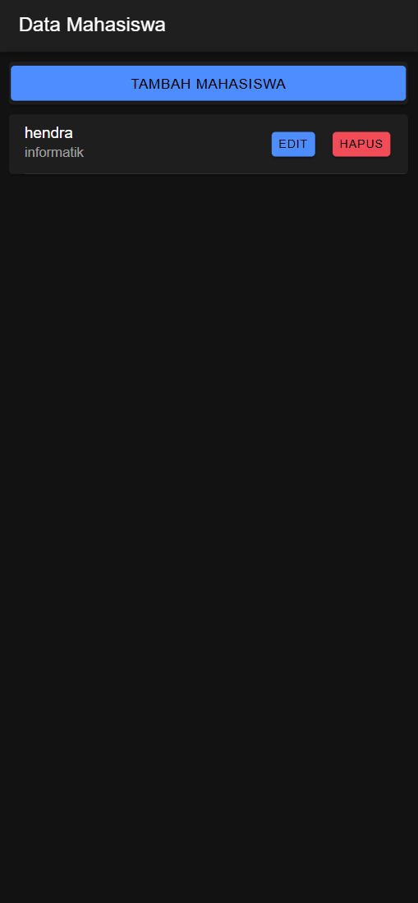
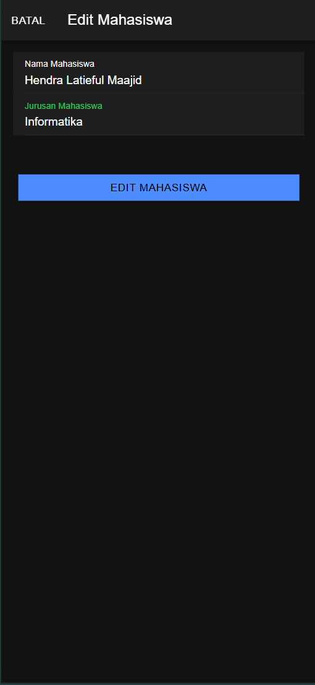
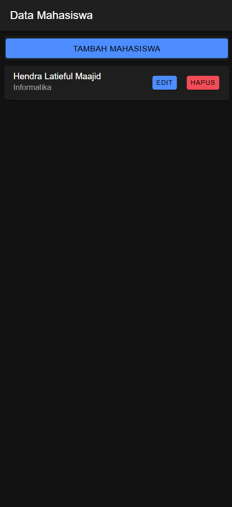
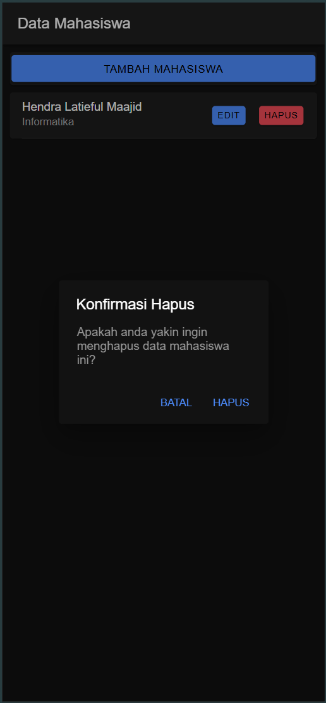
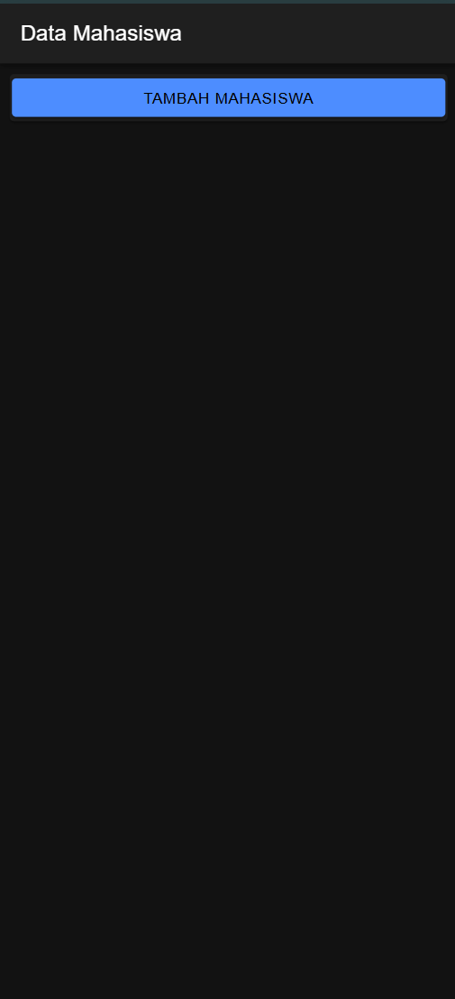

# CRUD Mahasiswa
- Hendra Latieful Maajid
- H1D022018
- Shift Baru F
- Shift KRS D

## 1. Create (Tambah Data)
Sistem mengimplementasikan penambahan mahasiswa melalui komponen berikut:
- Dipicu oleh tombol "Tambah Mahasiswa"
- 
- Membuka form modal dengan field input untuk:
  - Nama Mahasiswa
  - Jurusan
- Detail implementasi:
  ```typescript
  tambahMahasiswa() {
    if (this.nama != '' && this.jurusan != '') {
      let data = {
        nama: this.nama,
        jurusan: this.jurusan,
      }
      this.api.tambah(data, 'tambah.php')
  ```
- 
- Melakukan validasi bahwa semua field wajib telah diisi
- Mengirim permintaan POST ke endpoint API 'tambah.php'
- Memperbarui daftar mahasiswa setelah berhasil menambahkan
- 

## 2. Read (Tampil Data)
Sistem mengimplementasikan pengambilan data dengan dua cara:
### 2.1 Menampilkan Semua Mahasiswa
- Dimuat secara otomatis saat inisialisasi halaman melalui `ngOnInit()`
- Implementasi:
  ```typescript
  getMahasiswa() {
    this.api.tampil('tampil.php').subscribe({
      next: (res: any) => {
        this.dataMahasiswa = res;
      }
    });
  }
  ```
- Menampilkan mahasiswa dalam bentuk kartu yang menunjukkan nama dan jurusan
- 

### 2.2 Pengambilan Data Mahasiswa Tunggal
- Digunakan saat mengedit data mahasiswa yang spesific
- Implementasi:
  ```typescript
  ambilMahasiswa(id: any) {
    this.api.lihat(id, 'lihat.php?id=').subscribe({
      next: (hasil: any) => {
        let mahasiswa = hasil;
        this.id = mahasiswa.id;
        this.nama = mahasiswa.nama;
        this.jurusan = mahasiswa.jurusan;
      }
    })
  }
  ```
  - 

## 3. Update (Edit Data)
Operasi update terdiri dari:
- Tombol edit pada setiap kartu mahasiswa
- Membuka modal dengan data mahasiswa yang sudah terisi
- Implementasi:
  ```typescript
  editMahasiswa() {
    let data = {
      id: this.id,
      nama: this.nama,
      jurusan: this.jurusan
    }
    this.api.edit(data, 'edit.php')
  ```
- Mengirim permintaan PUT ke 'edit.php'
- Memperbarui daftar mahasiswa setelah berhasil mengedit
- Termasuk validasi form
- Menyediakan opsi untuk membatalkan
- 
- 

## 4. Delete (Hapus Data)
Operasi hapus memiliki fitur:
- Tombol hapus pada setiap kartu mahasiswa
- Muncul Dialog konfirmasi sebelum penghapusan
- Implementasi:
  ```typescript
  hapusMahasiswa(id: any) {
    const alert = await this.alertController.create({
      header: 'Konfirmasi Hapus',
      message: 'Apakah anda yakin ingin menghapus data mahasiswa ini?',
      buttons: [
        {
          text: 'Batal',
          role: 'cancel'
        }, 
        {
          text: 'Hapus',
          role: 'confirm',
          handler: () => {
            this.api.hapus(id, 'hapus.php?id=')
          }
        }
      ]
    });
  }
  ```
- 
- Mengirim permintaan DELETE ke 'hapus.php'
- Secara otomatis memperbarui daftar setelah berhasil menghapus
- 

## Endpoint API

Sistem berkomunikasi dengan endpoint PHP berikut:
- CREATE: `tambah.php`
- READ: `tampil.php` (semua mahasiswa), `lihat.php?id=` (mahasiswa tunggal)
- UPDATE: `edit.php`
- DELETE: `hapus.php?id=`


